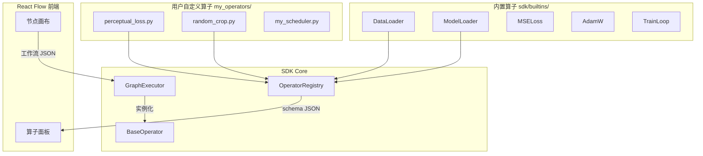

# 通用训练算子 SDK + React Flow 低代码框架

构建模态无关的通用训练算子 SDK，支持图像/视频/音频/文本/多模态训练。

---

## 核心理念

> **"写一个算子，只需实现 `forward()` 和声明 `schema`"**

借鉴天授的最小实现接口思想，但设计为**模态无关**的通用训练算子系统。

---

## 算子 SDK 设计

### 1. 核心基类 `BaseOperator`

```python
# sdk/operators/base.py
from abc import ABC, abstractmethod
from dataclasses import dataclass, field
from typing import Any, Dict, List, Optional
import torch

@dataclass
class Port:
    """算子端口定义"""
    name: str
    dtype: str  # "tensor", "scalar", "config", "any"
    shape: Optional[str] = None  # "B,C,H,W" or "dynamic"
    required: bool = True
    description: str = ""

@dataclass
class Param:
    """算子参数定义"""
    name: str
    dtype: str  # "int", "float", "str", "bool", "enum", "list"
    default: Any = None
    options: List[Any] = field(default_factory=list)  # for enum
    range: tuple = None  # (min, max) for numeric
    description: str = ""

class BaseOperator(ABC):
    """
    通用训练算子基类
    
    用户只需实现:
    1. schema() - 声明输入/输出/参数
    2. forward() - 核心计算逻辑
    
    可选重写:
    - setup() - 初始化 (加载模型等)
    - teardown() - 清理资源
    - validate() - 自定义验证
    """
    
    # ==================== 必须实现 ====================
    
    @classmethod
    @abstractmethod
    def schema(cls) -> dict:
        """
        声明算子的元信息
        
        Returns:
            {
                "name": "算子名称",
                "category": "loss | data | model | optimizer | callback | custom",
                "description": "算子描述",
                "inputs": [Port(...)],
                "outputs": [Port(...)],
                "params": [Param(...)],
                "tags": ["image", "video", "lora", ...]  # 可选标签
            }
        """
        pass
    
    @abstractmethod
    def forward(self, inputs: Dict[str, Any], params: Dict[str, Any]) -> Dict[str, Any]:
        """
        核心计算逻辑
        
        Args:
            inputs: 上游算子传入的数据 {port_name: value}
            params: 用户配置的参数 {param_name: value}
            
        Returns:
            输出数据 {port_name: value}
        """
        pass
    
    # ==================== 可选重写 ====================
    
    def setup(self, params: Dict[str, Any]) -> None:
        """初始化阶段 (如加载模型、预编译等)"""
        pass
    
    def teardown(self) -> None:
        """清理阶段 (释放资源)"""
        pass
    
    def validate(self, inputs: Dict[str, Any], params: Dict[str, Any]) -> List[str]:
        """自定义验证，返回错误信息列表"""
        return []
    
    # ==================== 内置方法 ====================
    
    @property
    def device(self) -> torch.device:
        """当前设备"""
        return self._device
    
    @property
    def dtype(self) -> torch.dtype:
        """当前精度"""
        return self._dtype
```

---

### 2. 用户编写算子示例

#### 示例 1: 自定义 Loss 算子

```python
# my_operators/perceptual_loss.py
from sdk.operators import BaseOperator, Port, Param
import torch
import torch.nn.functional as F

class PerceptualLossOperator(BaseOperator):
    """感知损失算子 - 使用 VGG 特征"""
    
    @classmethod
    def schema(cls):
        return {
            "name": "Perceptual Loss",
            "category": "loss",
            "description": "基于 VGG 特征的感知损失",
            "inputs": [
                Port("predicted", "tensor", "B,C,H,W", description="模型预测"),
                Port("target", "tensor", "B,C,H,W", description="目标图像"),
            ],
            "outputs": [
                Port("loss", "scalar", description="感知损失值"),
            ],
            "params": [
                Param("layers", "list", default=["relu2_2", "relu3_3"], 
                      description="使用的 VGG 层"),
                Param("weight", "float", default=1.0, range=(0, 10)),
            ],
            "tags": ["image", "style-transfer", "perceptual"],
        }
    
    def setup(self, params):
        from torchvision.models import vgg19
        self.vgg = vgg19(pretrained=True).features.eval()
        self.vgg.to(self.device)
        self.layers = params.get("layers", ["relu2_2", "relu3_3"])
    
    def forward(self, inputs, params):
        pred = inputs["predicted"]
        target = inputs["target"]
        
        pred_features = self._extract_features(pred)
        target_features = self._extract_features(target)
        
        loss = sum(
            F.mse_loss(p, t) 
            for p, t in zip(pred_features, target_features)
        )
        
        return {"loss": loss * params.get("weight", 1.0)}
    
    def _extract_features(self, x):
        features = []
        for name, layer in self.vgg.named_children():
            x = layer(x)
            if name in self.layers:
                features.append(x)
        return features
```

#### 示例 2: 自定义数据增强算子

```python
# my_operators/random_crop.py
class RandomCropOperator(BaseOperator):
    """随机裁剪 - 适用于任何 2D 数据"""
    
    @classmethod
    def schema(cls):
        return {
            "name": "Random Crop",
            "category": "data",
            "description": "随机裁剪图像/特征图",
            "inputs": [
                Port("image", "tensor", "B,C,H,W"),
            ],
            "outputs": [
                Port("cropped", "tensor", "B,C,H',W'"),
            ],
            "params": [
                Param("size", "int", default=512, range=(64, 2048)),
                Param("keep_aspect", "bool", default=True),
            ],
            "tags": ["image", "video", "augmentation"],
        }
    
    def forward(self, inputs, params):
        import torchvision.transforms.functional as TF
        image = inputs["image"]
        size = params["size"]
        cropped = TF.random_crop(image, (size, size))
        return {"cropped": cropped}
```

#### 示例 3: 模态无关的通用训练循环

```python
# my_operators/train_loop.py
class TrainLoopOperator(BaseOperator):
    """通用训练循环 - 模态无关"""
    
    @classmethod
    def schema(cls):
        return {
            "name": "Train Loop",
            "category": "core",
            "description": "通用训练循环，支持任意模态",
            "inputs": [
                Port("model", "any", description="任意可训练模型"),
                Port("dataloader", "any", description="数据加载器"),
                Port("loss_fn", "callable", description="损失函数"),
                Port("optimizer", "any", description="优化器"),
            ],
            "outputs": [
                Port("trained_model", "any"),
                Port("metrics", "dict"),
            ],
            "params": [
                Param("epochs", "int", default=10, range=(1, 1000)),
                Param("grad_accum", "int", default=1, range=(1, 128)),
                Param("max_grad_norm", "float", default=1.0),
                Param("log_interval", "int", default=100),
            ],
            "tags": ["core", "training"],
        }
    
    def forward(self, inputs, params):
        model = inputs["model"]
        dataloader = inputs["dataloader"]
        loss_fn = inputs["loss_fn"]
        optimizer = inputs["optimizer"]
        
        for epoch in range(params["epochs"]):
            for step, batch in enumerate(dataloader):
                # 模态无关: batch 结构由上游算子决定
                loss = loss_fn(model, batch)
                loss.backward()
                
                if (step + 1) % params["grad_accum"] == 0:
                    torch.nn.utils.clip_grad_norm_(
                        model.parameters(), params["max_grad_norm"]
                    )
                    optimizer.step()
                    optimizer.zero_grad()
        
        return {"trained_model": model, "metrics": {...}}
```

---

### 3. 算子注册与发现

```python
# sdk/registry.py
import importlib
import pkgutil
from pathlib import Path

class OperatorRegistry:
    """算子注册表 - 自动发现用户算子"""
    
    _operators: Dict[str, type] = {}
    
    @classmethod
    def register(cls, op_class: type):
        """装饰器注册"""
        schema = op_class.schema()
        cls._operators[schema["name"]] = op_class
        return op_class
    
    @classmethod
    def discover(cls, package_path: str):
        """自动发现目录下所有算子"""
        path = Path(package_path)
        for file in path.glob("**/*.py"):
            if file.name.startswith("_"):
                continue
            # 动态导入并注册
            module = importlib.import_module(str(file))
            for attr in dir(module):
                obj = getattr(module, attr)
                if isinstance(obj, type) and issubclass(obj, BaseOperator):
                    cls.register(obj)
    
    @classmethod
    def list_all(cls) -> List[dict]:
        """列出所有算子 schema (供前端展示)"""
        return [op.schema() for op in cls._operators.values()]
    
    @classmethod
    def get(cls, name: str) -> type:
        """获取算子类"""
        return cls._operators.get(name)

# 使用装饰器注册
@OperatorRegistry.register
class MyCustomLoss(BaseOperator):
    ...
```

---

## 架构图



---

## 模态支持示例

| 模态 | 数据类型 | 示例算子 |
|------|----------|----------|
| 🖼️ 图像 | `B,C,H,W` tensor | VAE Encode/Decode, DiT Forward |
| 🎬 视频 | `B,T,C,H,W` tensor | 3D VAE, Temporal Attention |
| 🔊 音频 | `B,T,C` tensor | Mel Spectrogram, WavEncoder |
| 📝 文本 | `B,L` token ids | Tokenize, TextEncoder |
| 🌐 多模态 | 混合 dict | CLIP, SigLIP, VL Fusion |

---

## 实施路线

### Phase 1: SDK Core (1周)
- `BaseOperator` 基类
- `Port/Param` 数据结构
- `OperatorRegistry` 注册发现
- `GraphExecutor` 图执行引擎

### Phase 2: 内置算子 (1周)
- 迁移 OneTrainer 模块为算子
- 数据/模型/Loss/优化器 基础算子

### Phase 3: React Flow 集成 (2周)
- 前端节点渲染
- 参数编辑面板
- 工作流保存/加载

### Phase 4: 生态 (持续)
- 算子市场
- 版本管理
- 社区分享

---

## 与天授的区别

| 对比项 | 天授 (Tianshou) | 本 SDK |
|--------|-----------------|--------|
| 领域 | 强化学习专用 | 通用训练 |
| 核心抽象 | Policy + Collector | Operator + Port |
| 输入输出 | Batch (固定结构) | 任意 tensor/dict |
| 模态支持 | 环境交互 | 图像/视频/音频/文本/多模态 |
| 扩展方式 | 继承 BasePolicy | 继承 BaseOperator |
